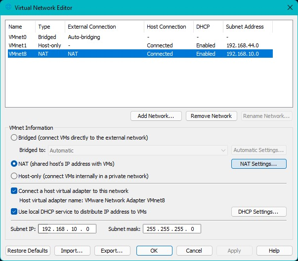
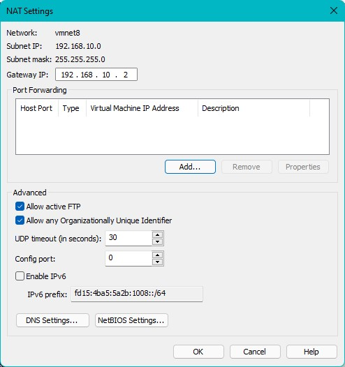

# Active Directory Labs for Red Teaming

This repository contains the code I use to build my local Active Directory labs and practice all sorts of attacks. It uses [Vagrant](https://www.vagrantup.com/) and some PowerShell magic to build and configure the labs.

## Structure of the Lab

This lab currently contains following machines:

- A Domain Controller: Windows Server 2019
- 2 Servers: Windows 2016
- 1 Workstation: Windows 10
- A Kali machine for attacking

## List of Attacks this lab is vulnerable to

Currently none. The lab just deploys the VMs, configures the DC and joins other machines to the domain as of now.

## Requirements

- [Vagrant](https://www.vagrantup.com/)
- VMWare
- PowerShell

My test environment was a Windows 11 machine with VMWare Workstation 16 and PowerShell 7.2. I have not tested this on Linux host with Linux-based PowerShell. I know I have used some PowerShell commands that aren't supported by Linux version of PowerShell, but you're free to experiment.

Also, the labs currently only support VMWare provider for Vagrant. I do plan to expand it to VirtualBox and Hyper-V provider in future.

### Configuring the NAT subnet

Due to the limitations of Vagrant with Windows and VMWare, you need to make sure you are modifying the IP addresses of machines to match the NAT (vmnet8) subnet of VMWare. You have two options here:

**Option 1: Modify the NAT subnet itself**

- Go to VMWare -> Edit -> Virtual Network Editor
- Click on "Change Settings"
- Select NAT network. It generally is VMnet8.
- Modify the Subnet IP to  `192.168.10.0`

- Click on "NAT Settings"
- Modify the Gateway IP to `192.168.10.2`

- Save the changes

**Option 2: Modify the IP addresses in `config.json`**

If you cannot modify the NAT subnet for any reason, open the `config.json` file and modify the IP addresses of all the machines to match the NAT subnet.

### Why not use Ansible instead of custom PowerShell scripts?

I wanted to honestly. But Ansible doesn't love Windows hosts and I do. It wasn't a perfect match. Also, I saw this as an opportunity to work on my PowerShell skills.

## Installation

> **Important:** Make sure you have matched machine's IP addresses with NAT subnet. Go through the "Configuring the NAT subnet" section above for details.

**First launch**: On an **elevated** PowerShell run `setup.ps1`

**After first launch**: Just `vagrant up` on an unelevated shell should do

To customize the labs, like Domain name or Administrator password, modify the `config.json` file.

***Full Disclosure**: `setup.ps1` would modify the TrustedHosts of WinRM while running to remotely manage the VMs. It would, however, restore it back to the original state after it's done. This is why it needs elevated access.*

## Thanks to

I've taken some inspiration from [alaebov's AD-lab](https://github.com/alebov/AD-lab). And the Vagrant boxes I've used are created by [StefanScherer](https://app.vagrantup.com/StefanScherer).

